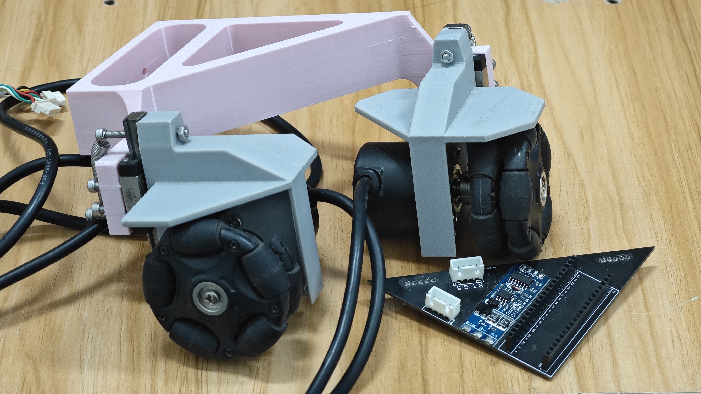

# ROBOCON2024-PPS
Plane Positioning System (Code Disk) Using Magnetic Encoding + Omni Wheels

## 📍 Project Introduction

**MTIPPS (Plane Positioning)** is an independent planar axis positioning control system developed by the MTI Robot Team, referencing Qingdao University of Technology's open-source design and based on the **STM32F103C8T6** microcontroller.

This system accurately reads the position information of objects in the XY plane through RS485 absolute encoders and sends it to the main control board in real-time via serial port. The system can record the traveled distance in real-time with **millimeter-level (mm) precision**. When installed on a robot chassis, it enables the robot to automatically walk along any path planned on the plane.

## ✨ Hardware and Communication Configuration

| Hardware Module | Interface/Protocol | Function | Notes |
| :--- | :--- | :--- | :--- |
| **Microcontroller** | STM32F103C8T6 | Core control and data processing | Controller for domestically independently developed positioning system. |
| **Positioning Sensor** | RS485 Absolute Encoder | Measure XY axis displacement | Achieve high-precision positioning on the base axis plane. |
| **Attitude Sensor** | Hi219 Gyroscope | Measure attitude angles (Yaw/Pitch/Roll) | Used for attitude compensation or status monitoring. |
| **Communication Interface 1** | **USART1** | Read Hi219 gyroscope data | Receive attitude information. |
| **Communication Interface 2** | **USART2** | **Send data to robot mainboard** | Provide positioning and attitude data to the main control board. |
| **Communication Interface 3** | **USART3** | Read RS485 absolute encoder | Receive high-precision positioning data. |

## 📜 Version Iteration Record

### V0.1 - Basic Positioning System Architecture Establishment

| Description | Changes | Notes |
| :--- | :--- | :--- |
| **Core Function** | Planar base axis positioning | Based on RS485 absolute encoders, realizing XY axis planar positioning. |
| **Precision** | Millimeter-level distance recording | Capable of recording traveled distance at any time, with **mm-level precision**. |
| **Application Goal** | Path planning | Enable robot chassis to travel according to path planning, achieving planar automatic walking. |
| **Communication Configuration** | Initialization configuration | Configure **USART1 (gyroscope)**, **USART2 (send to mainboard)**, **USART3 (RS485 encoder)**. |

### V0.2 - Program Structure Optimization and Gyroscope Adaptation Attempt (240417)

| Description | Changes | Notes |
| :--- | :--- | :--- |
| **Modifier** | Lain | Responsible for program optimization and function adaptation of this version. |
| **Architecture Optimization** | Optimize program structure | Improve code readability and maintainability. |
| **Gyroscope Adaptation** | Re-integrate gyroscope adaptation | Ensure correct parsing and usage of Hi219 data. |
| **Data Sending Attempt 1** | Prepare data to be sent in `it.c` | **Attempt Method 1**: In the `prepare_data()` function, assign floating-point data from encoders and gyroscopes to the `remote_states` array. |
| **Attempt 1 Failure** | Result: Failed | The attempt method failed to achieve effective data sending or receiving. |
| **Data Sending Attempt 2** | Modify serial port configuration | **Attempt Method 2**: Modify serial port configuration |

#### V0.2 (240417) Data Sending Structure/Array Mapping (Attempt Method 1)

The following is the mapping relationship for V0.2's attempt to prepare data for sending in the `void prepare_data(void)` function:

```c
void prepare_data(void) {
    // Assign floating-point data to be sent to the remote_states array
    memset(remote_states, 0, sizeof(remote_states)); // Clear array content

    // Encoder positioning data
    remote_states[0] = Positioning.X_laps;        // X-axis laps
    remote_states[1] = Positioning.X_distance_mm; // X-axis distance (mm)
    remote_states[2] = Positioning.Y_laps;        // Y-axis laps
    remote_states[3] = Positioning.Y_distance_mm; // Y-axis distance (mm)

    // Hi219 attitude data (angles)
    remote_states[4] = P_stHi219m.Yaw;            // Yaw angle
    remote_states[5] = P_stHi219m.Pitch;          // Pitch angle
    remote_states[6] = P_stHi219m.Roll;           // Roll angle

    // Hi219 attitude data (angular velocities)
    remote_states[7] = P_stHi219m.Yaw_Gyo;        // Yaw angular velocity
    remote_states[8] = P_stHi219m.Pitch_Gyo;      // Pitch angular velocity
    remote_states[9] = P_stHi219m.Roll_Gyo;       // Roll angular velocity

    // Hi219 attitude data (historical/continuous values)
    remote_states[10] = P_stHi219m.Last_Yaw;      // Previous Yaw
    remote_states[11] = P_stHi219m.Last_Pitch;    // Previous Pitch
    remote_states[12] = P_stHi219m.Last_Roll;     // Previous Roll
    remote_states[13] = P_stHi219m.Continuous_Pitch; // Continuous Pitch angle
    remote_states[14] = P_stHi219m.Continuous_Roll;  // Continuous Roll angle
    remote_states[15] = P_stHi219m.Continuous_Yaw;   // Continuous Yaw angle
}
```

# ROBOCON2024-PPS
使用磁编码+全向轮的平面定位系统（码盘）

## 📍 项目简介

**MTIPPS(PlanePositioning)** 是MTI机器人战队参考青岛理工大学开源并基于 **STM32F103C8T6** 微控制器开发的独立平面基轴定位控制系统。

该系统通过 RS485 绝对值编码器，精确地读取物体在 XY 平面上的位置信息，并实时通过串口发送给主控板。本系统能够实时记录走过的路程，**精度可达毫米级 (mm)**。安装在机器人底盘上，可实现机器人按路径规划在平面上任意路径的自动行走。

## ✨ 硬件与通信配置

| 硬件模块 | 接口/协议 | 作用 | 备注 |
| :--- | :--- | :--- | :--- |
| **微控制器** | STM32F103C8T6 | 核心控制与数据处理 | 国内自主开发定位系统的控制器。 |
| **定位传感器** | RS485 绝对值编码器 | 测量 XY 轴位移 | 实现基轴平面的高精度定位。 |
| **姿态传感器** | Hi219 陀螺仪 | 测量姿态角 (Yaw/Pitch/Roll) | 用于姿态补偿或状态监测。 |
| **通信接口 1** | **USART1** | 读取 Hi219 陀螺仪数据 | 接收姿态信息。 |
| **通信接口 2** | **USART2** | **发送数据给机器人主板** | 向主控板提供定位和姿态数据。 |
| **通信接口 3** | **USART3** | 读取 RS485 绝对值编码器 | 接收高精度定位数据。 |

## 📜 版本迭代记录

### V0.1 - 基础定位系统架构建立

| 描述 | 变动点 | 备注 |
| :--- | :--- | :--- |
| **核心功能** | 平面基轴定位 | 基于 RS485 绝对值编码器，实现 XY 轴平面定位。 |
| **精度** | 毫米级路程记录 | 能够时刻记录走过的路程，**精度达 mm 级别**。 |
| **应用目标** | 路径规划 | 可使机器人底盘按路径规划行驶，实现平面自动行走。 |
| **通信配置** | 初始化配置 | 配置 **USART1 (陀螺仪)**, **USART2 (发送给主板)**, **USART3 (RS485 编码器)**。 |

### V0.2 - 程序结构优化与陀螺仪适配尝试 (240417)

| 描述 | 变动点 | 备注 |
| :--- | :--- | :--- |
| **更改人** | Lain | 负责此版本的程序优化和功能适配。 |
| **架构优化** | 优化程序结构 | 提高代码可读性和维护性。 |
| **陀螺仪适配** | 重新加入陀螺仪适配 | 确保 Hi219 数据的正确解析和使用。 |
| **数据发送尝试 1** | 在 `it.c` 中准备待发送数据 | **尝试方法 1**：在 `prepare_data()` 函数中，将编码器和陀螺仪的浮点数数据赋值给 `remote_states` 数组。 |
| **尝试 1 失败** | 结果：失败 | 尝试方法未能成功实现数据的有效发送或接收。 |
| **数据发送尝试 2** | 更改串口配置 | **尝试方法 2**：修改串口配置 |

#### V0.2 (240417) 数据发送结构体/数组映射 (尝试方法 1)

以下是 V0.2 尝试在 `void prepare_data(void)` 函数中准备发送数据的映射关系：

```c
void prepare_data(void) {
    // 待发送的浮点数数据赋值给 remote_states 数组
    memset(remote_states, 0, sizeof(remote_states)); // 清除数组内容

    // 编码器定位数据
    remote_states[0] = Positioning.X_laps;        // X 轴圈数
    remote_states[1] = Positioning.X_distance_mm; // X 轴距离 (mm)
    remote_states[2] = Positioning.Y_laps;        // Y 轴圈数
    remote_states[3] = Positioning.Y_distance_mm; // Y 轴距离 (mm)

    // Hi219 姿态数据 (角度)
    remote_states[4] = P_stHi219m.Yaw;            // 偏航角 (Yaw)
    remote_states[5] = P_stHi219m.Pitch;          // 俯仰角 (Pitch)
    remote_states[6] = P_stHi219m.Roll;           // 横滚角 (Roll)

    // Hi219 姿态数据 (角速度)
    remote_states[7] = P_stHi219m.Yaw_Gyo;        // 偏航角速度
    remote_states[8] = P_stHi219m.Pitch_Gyo;      // 俯仰角速度
    remote_states[9] = P_stHi219m.Roll_Gyo;       // 横滚角速度

    // Hi219 姿态数据 (历史/连续值)
    remote_states[10] = P_stHi219m.Last_Yaw;      // 上一个 Yaw
    remote_states[11] = P_stHi219m.Last_Pitch;    // 上一个 Pitch
    remote_states[12] = P_stHi219m.Last_Roll;     // 上一个 Roll
    remote_states[13] = P_stHi219m.Continuous_Pitch; // 连续俯仰角
    remote_states[14] = P_stHi219m.Continuous_Roll;  // 连续横滚角
    remote_states[15] = P_stHi219m.Continuous_Yaw;   // 连续偏航角
}
```
